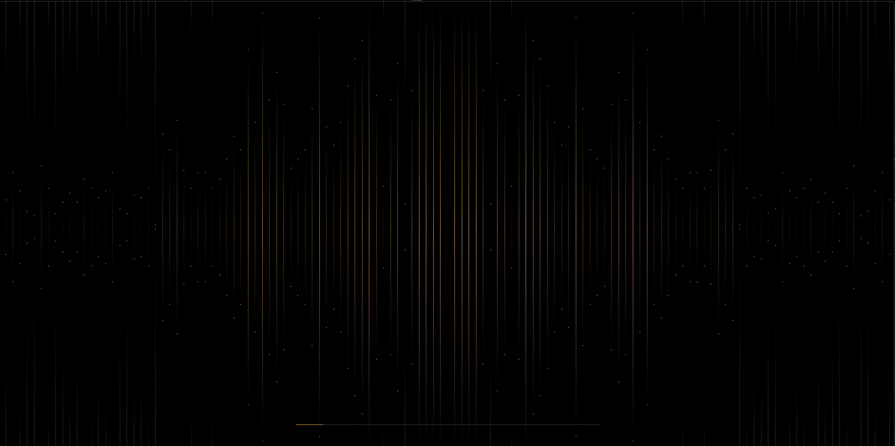

# *`BASS-audio-simulator`*
`DEMO`

# About

controls audio playback and visualizes sound frequencies in real-time using the <a href="https://www.un4seen.com/">BASS</a> audio library and <a href="https://github.com/codam-coding-college/MLX42">MLX42</a> graphics library.

## Features
- **Play/Pause Control:** Press `SPACE` to play or pause audio.
- **Seek Audio Position:** Use `LEFT` or `RIGHT` arrow keys to adjust the playback position.
- **Color Customization:** Choose from predefined colors for the spectrum display.

## Usage

`./as [AUDIO_FILE] [RED/BLUE/GREY/PURPLE/WHITE/BROWN]`

## Examples

